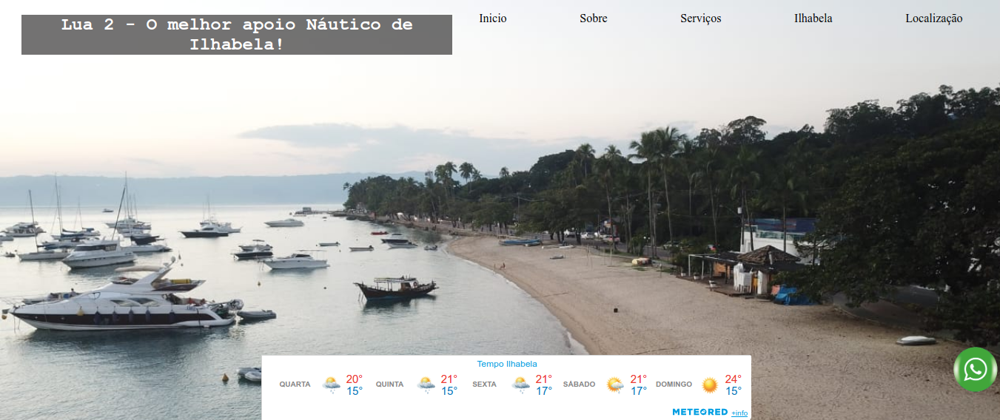

<div align="center">
    
</div>
<div align="center">
    <p> Acesse: <a href="https://lua2.com.br" target="blanck" >https://lua2.com.br</a>
    </p>
</div>
</br></br>
<h2>Sobre o Projeto </h2>
</br>
<div>
<p>Projeto front-end</p>
<p>Projeto construído utilizando HTML, CSS e JavaScript, é uma LandPage para empresa de serviços náuticos.
</p>
</div>
<h2>Tecnologias utilizadas:</h2>
<div >
<ul>
<li>HTML</li>
<li>CSS</li>
<li>JavaScript</li>
</ul>
</div>
</br>
<h2>Como executar o projeto</h2>

```bash

# clonar repositório

git clone git@github.com:Paulo-cds/lua.git

# entrar na pasta do projeto

cd projeto

# executar o projeto

yarn start

o projeto será executado no localhost:3000

```

</br>
<h2>Autor:</h2>
<p>Paulo Ricardo Pereira Domingues</p>
<p><a href="https://www.linkedin.com/in/paulorpd/" target="blanck">https://www.linkedin.com/in/paulorpd/</a></p>
<p><a href="https://paulo-rpd.vercel.app/" target="blanck">https://paulo-rpd.vercel.app/</a></p>
